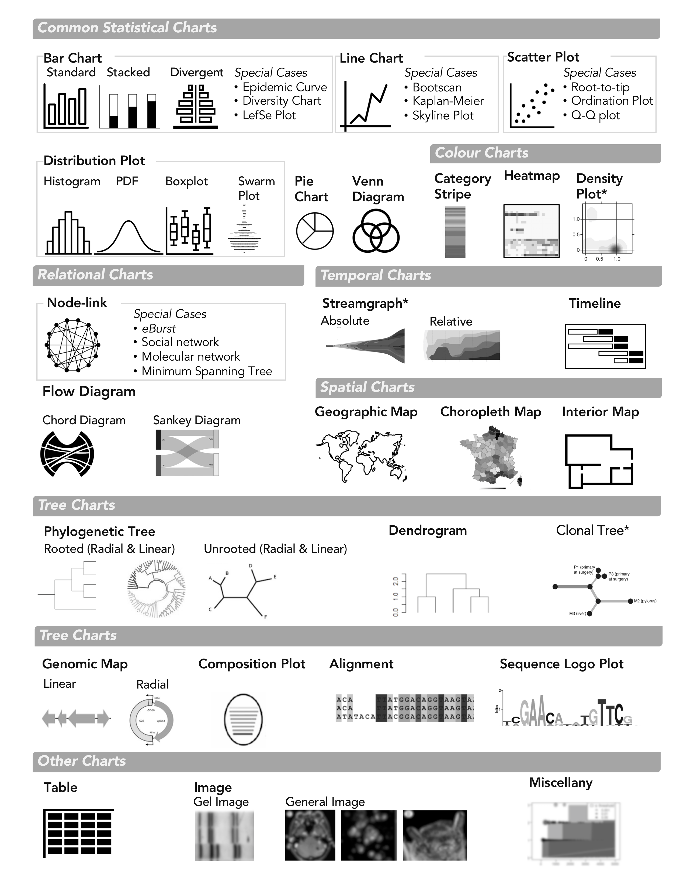
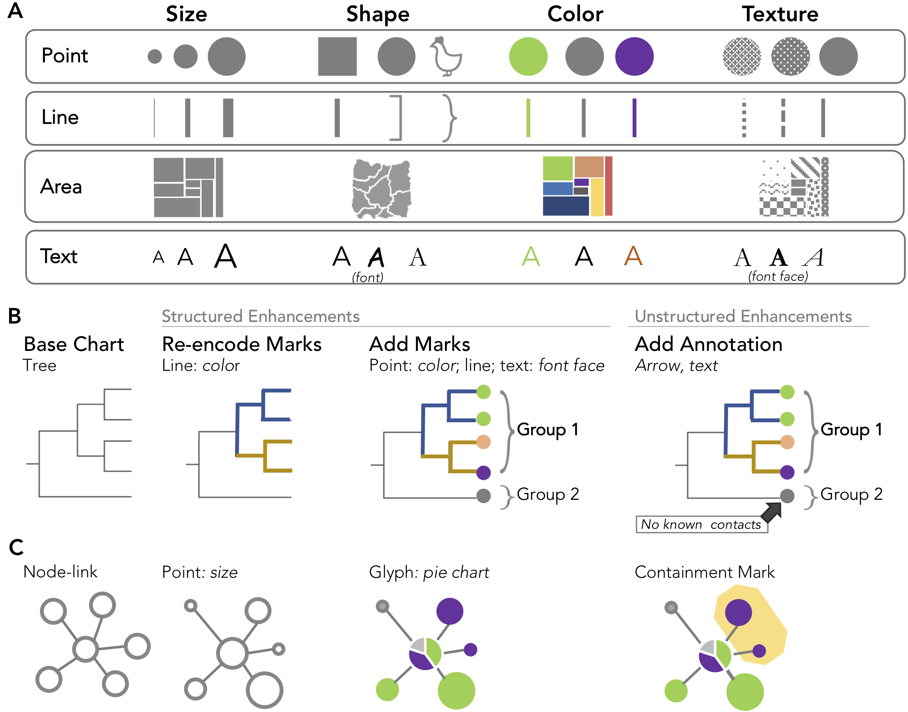
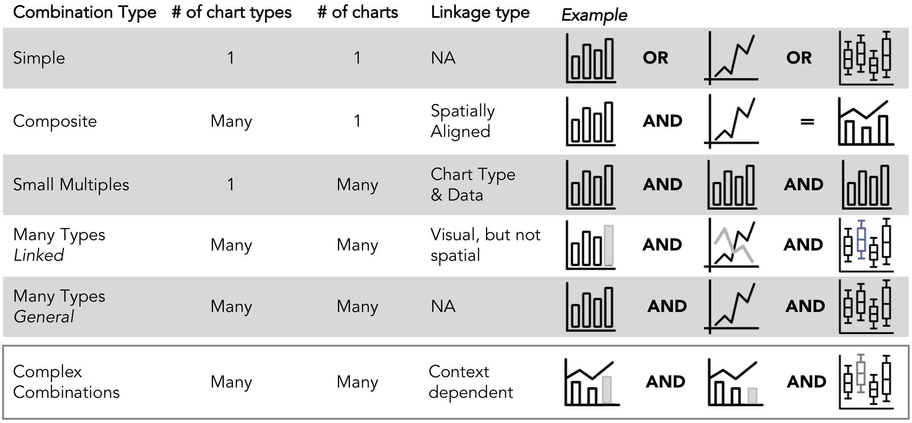

# Welcome to the GEViT Gallery
[Overview](#overview) | [Visualization Design](#visDesign) | [Visualization Context](#visContext) | [Structure and Filtering](#galStructure) | [Disclaimer](#disclaimer) | [Cite](#citation)

<hr>
<h2 id="overview">Overview</h2>

This gallery for GEViT, a <b>G</b>enomic <b>E</b>pidemiology <b>Vi</b>sualization <b>T</b>ypology, provides a way to browse the research findings presented in Crisan *et. al.* (2018) ['A method for systematically surveying data visualizations in infectious disease genomic epidemiology'](https://doi.org/10.1101/325290). We constructed a visualization design space that characterized common data visualization practices within infectious disease genomic epidemiology that supports exploration through two axes: visualization context (pathogens and a priori concepts) and visualization design (chart types, chart enhancements, and chart combinations).

<strong>To get started, click on the catalogue tab and use the sidebar to filter visualizations</strong>

<hr>
<h2 id="visDesign" style="margin-left: 0;">Visualization Design</h2>

Visualization designs detail how a data visualization was constructed; they constitute chart types, chart combinations, and chart enhancements.

<div class = "row">
  <div class = "col-md-6">
    
  </div>

  <div class = "col-md-6">
  <p><em><strong>Chart types</strong></em> are the basic building block of data visualizations. Our analysis of the infectious disease genomic epidemiology literature revealed 25 unique chart types that we further characterized into eight categories. </p>
  </div>
</div>

<br><br>

<div class="row">
<div class = "col-md-6">

</div>
 <div class = "col-md-6">
<p><em><strong>Chart enhancements</strong></em> are changes to the base chart types to encode additional information. We differentiated between instances of adding new marks to the chart type and of re-encoding existing marks in order to encode additional information. In the figure above we <strong>a)</strong> summarize the types of chart enhancements documented in our research and show an example of enhancements to <strong>b)</strong> a phylogenetic tree and <strong>c)</strong> a node-link diagram.</p>
</div>
</div>

<br><br>
<div class="row">
<div class = "col-md-6">
 
</div>
<div class = "col-md-6">
<p><em><strong>Chart combinations</strong></em> can show different aspects of the data that are not directly captured in a single chart. In our research we found distinct patterns for how charts were combined to show additional information. There were five distinct types of chart combinations.</p>
</div>
</div>

<hr>
<h2 id="visContext" style="margin-left: 0;">Visualization Context</h2>
Visualization context is derived from pathogen information derived from article titles and abstracts, the application of a priori concepts, and the existence of text in the figure captions. There are a total of 33 pathogens, 23 a priori concepts, and hundreds of terms within the figure captions. Within the sidebar menu, you can **click on the text box and start typing** to explore different options. 

<div class="row">
  <div class = "col-md-6">
    <h3><em>Pathogens</em></h3>
    <p><em>There are a  total of 33 pathogens (+ 1 cancer category) that are found within the GEViT gallery dataset:</em></p>
<p>Acinetobact baumannii, Bacillus anthracis, Clostridium difficile, Dengue virus, Ebola virus, Enterococcus faecium, Enterovirus D68, Escherichia coli, Helicobacter pylori, Hepatitis B, Hepatitis C, Hepatitis E, Human herpesvirus, Human Immunodeficy Virus, Human Papillomavirus, Human rotavirus, Influenza Virus, Klebsiella pneumonia, Legionella pneumophila, Listeria monocytogenes, MERS coronavirus, Microbiota, Mycobacterium tuberculosis, Neisseria gonorrhoeae, Neisseria meningitidis, Pseudomona aeruginosa, Salmonella Enterica, Salmonella typhimurium, SARS Coronavirus, Staphylococcus aureus, Vibrio cholerae, Vibrio parahaemolyticus, Zika virus<p>
  </div>
<div class = "col-md-6">
<h3><em>A priori concepts</em></h3>
<p> Genomic concepts: drug resistance, genome, genotype, molecular biology, pathogen characterization, phylogeny, and population diversity</p>

<p> Epidemiology concepts: clusters, disease reservoirs, geography, outbreaks (at international, community, and hospital levels), surveillance, transmission, vaccine, and vectors<p>

<p> Medical concepts: clinical, cancer, diagnosis, outcome, and treatment</p> 
</div>

</div>

<hr>
<h2 id="galStructure" style="margin-left: 0;">Structure and Filtering</h2>

**Catalogue:** 
The catalogue contains figures and some "missed opportunity" tables that can be browsed or filtered by visualization context and design details. The library catalogue was current to August 2017. We are considering ways to automatically expand the GEViT gallery, so stay tuned for future updates!

**Individual Figures:**
When an figure is clicked, you will be automatically re-directed to the Figure tab, which will provide additional details about the visualization design. You will also be able to link back to the original source publication.

**Sidebar Menu:** 
The sidebar menu primarily supports filtering functions for the gallery, which are listed below. In all filtering options it is possible to *click in the search box* and *start typing* in order to review the options. 

**Filtering:**
You can simply browse the gallery catalogue, or filter data visualizations to target different contexts (for example a hospital outbreak with specific pathogens). You can filter by visualization context, or you can filter by any of the chart types and chart combinations, and you have the option of limiting your search to chart types that have some form of enhancement. 

<hr>
<h2 id="disclaimer">Disclaimer</h2>
The images in the GEViT gallery are presented solely for research purposes and under copyright Fair Use terms. Clicking on an image provides a link back to the original source publication. Beyond the images themselves no other materials relating to the published articles (such as PDFs of the full text) have been made available. If you are an author of a publication contained within this gallery and you would like your work to be removed please [notify us](https://github.com/amcrisan/gevit_gallery_v2/issues).

<hr>
<h2 id="citation">Cite</h2>
If you use this gallery in your research, please consider citing the original publication:

```
A systematic method for surveying data visualizations and a resulting genomic epidemiology visualization typology: GEViT 
Anamaria Crisan  Jennifer L Gardy  Tamara Munzner
Bioinformatics, https://doi.org/10.1093/bioinformatics/bty832
```

You can also find our analysis code online : https://github.com/amcrisan/GEViTAnalysisRelease

as well as the code for this gallery : https://github.com/amcrisan/gevit_gallery_v2
